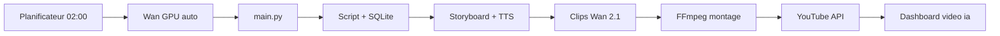

# Plan 1 jour — automatisation 100 % autonome

Objectif : **vidéo IA 30 min+** publiée sur YouTube **sans intervention manuelle**, suivi via l’icône Bureau **video ia**.

```
Script → Storyboard → Audio → Clips Wan → Montage FFmpeg → YouTube → Dashboard
```

---

## Réponse rapide : VPS ou PC NVIDIA ?

| Question | Réponse |
|---|---|
| Peut-on mettre Wan sur un VPS OVH **sans GPU** ? | **Non** — Wan a besoin d’une carte NVIDIA |
| Où faire tourner le projet ? | **PC tour NVIDIA** (ton cas actuel) |
| Rôle du VPS ? | Optionnel : héberger un site web, pas le moteur vidéo |
| Plus besoin de `LANCER-WAN-NVIDIA.bat` ? | **Oui** — double-clic **video ia** démarre Wan + dashboard |

---

## Tableau de suivi (coche au fur et à mesure)

| # | Étape | Durée estimée | Statut | Notes |
|---|---|---|---|---|
| 1 | Cloner / mettre à jour le projet | 5 min | ☐ | `git pull` sur branche `cursor/conte-factory-pipeline-0391` |
| 2 | Installer Wan NVIDIA (`INSTALL-NVIDIA.ps1`) | 30–60 min | ☐ | Télécharge modèles + PyTorch CUDA |
| 3 | Vérifier GPU (`nvidia-smi`, `cuda True`) | 5 min | ☐ | |
| 4 | Créer l’icône Bureau **video ia** | 2 min | ☐ | `install-desktop-shortcut.ps1` |
| 5 | Premier lancement tout-en-un | 3 min | ☐ | Double-clic **video ia** → Wan + http://127.0.0.1:8501 |
| 6 | Test court sans YouTube | 15–45 min | ☐ | Dashboard → test court, ou `main.py --short --no-publish` |
| 7 | Configurer YouTube (`client_secrets.json`) | 20 min | ☐ | Voir `YOUTUBE.md` |
| 8 | Test publication (privée) | 10 min | ☐ | `CONTE_YOUTUBE_PRIVACY=private` |
| 9 | Installer automatisation Windows | 5 min | ☐ | `install-windows-autostart.ps1` |
| 10 | Première vidéo 30 min (nuit) | 3–8 h GPU | ☐ | Planificateur 02:00 ou lancement manuel |
| 11 | Vérifier dashboard le matin | 5 min | ☐ | Statut, YouTube ID, alertes |

**Total mise en place (hors génération 30 min) : ~2 h**  
**Première vidéo longue prête : même soir ou lendemain matin** selon ta carte (RTX 3080 ≈ 4–6 h pour 30 min).

---

## Matin — Étapes 1 à 5 (installation)

### Étape 1 — Récupérer le projet

```powershell
cd $env:USERPROFILE
if (-not (Test-Path mon-site)) {
  git clone --branch cursor/conte-factory-pipeline-0391 --single-branch https://github.com/urdirditfurd/mon-site.git
} else {
  cd mon-site
  git pull origin cursor/conte-factory-pipeline-0391
}
```

### Étape 2 — Installer Wan sur ta carte NVIDIA

```powershell
irm https://raw.githubusercontent.com/urdirditfurd/mon-site/cursor/conte-factory-pipeline-0391/pinokio/wan-snapdragon-arm/INSTALL-NVIDIA.ps1 | iex
```

Tu dois voir `cuda True` et le nom de ta carte (ex. RTX 3080).

### Étape 3 — Icône Bureau

```powershell
powershell -ExecutionPolicy Bypass -File "$env:USERPROFILE\mon-site\conte-factory\scripts\install-desktop-shortcut.ps1"
```

### Étape 4 — Lancer tout en un clic

**Double-clic sur l’icône « video ia »** sur le Bureau.

Ce qui se passe automatiquement :
1. Wan démarre sur le GPU (port 7860)
2. Le dashboard s’ouvre (port 8501)
3. Tu vois l’état en direct : Wan 🟢, vidéos, erreurs

> Tu n’as **plus** besoin d’ouvrir `LANCER-WAN-NVIDIA.bat` à la main.

### Étape 5 — Vérifier

- http://127.0.0.1:8501 → bandeau **Wan 🟢 EN LIGNE**
- Onglet **Wan en direct** → interface Gradio intégrée

---

## Après-midi — Étapes 6 à 8 (tests)

### Test court (recommandé)

Dans le dashboard → onglet **Piloter le pipeline** :
- Coche **Test court**
- Coche **Ne pas publier** (première fois)
- Clique **Lancer pipeline complet**

Ou en PowerShell :

```powershell
cd $env:USERPROFILE\mon-site\conte-factory
.\.venv\Scripts\activate
python main.py --short --theme "un lapin courageux" --no-publish
```

### YouTube (une fois)

1. [Google Cloud Console](https://console.cloud.google.com/) → active **YouTube Data API v3**
2. Télécharge `client_secrets.json` → place dans `conte-factory\secrets\`
3. Installe les libs :

```powershell
.\.venv\Scripts\pip.exe install google-api-python-client google-auth-oauthlib google-auth-httplib2
```

4. Dans `.env` :

```env
CONTE_AUTO_PUBLISH=1
CONTE_YOUTUBE_PRIVACY=private
```

Guide détaillé : `YOUTUBE.md`

### Test avec publication

```powershell
python main.py --short --theme "test publication" 
```

La vidéo arrive en **privé** sur YouTube si les secrets sont OK.

---

## Soir — Étapes 9 à 11 (automatisation 100 %)

### Installer le planificateur Windows

```powershell
powershell -ExecutionPolicy Bypass -File "$env:USERPROFILE\mon-site\conte-factory\scripts\install-windows-autostart.ps1"
```

Cela crée deux tâches :

| Tâche | Quand | Action |
|---|---|---|
| `VideoIA-Dashboard` | À chaque connexion Windows | Wan + dashboard |
| `VideoIA-PipelineNuit` | Tous les jours 02:00 | Pipeline complet → YouTube |

Logs du pipeline nocturne : `conte-factory\data\scheduled.log`  
Logs Wan : `conte-factory\data\wan_server.log`

### Lancer une vraie vidéo 30 min

Soit tu laisses le planificateur faire à 02:00, soit tu lances maintenant :

```powershell
cd $env:USERPROFILE\mon-site\conte-factory
.\.venv\Scripts\activate
python main.py --theme "la princesse et les étoiles"
```

Le MP4 final : `data\exports\`  
Publication : automatique si `CONTE_AUTO_PUBLISH=1`

### Le matin — routine « dashboard matinal »

1. Ouvre **video ia** (ou laisse la tâche l’avoir déjà ouvert)
2. Vérifie : **Publiées**, **Erreurs**, lien YouTube
3. Si besoin : bouton **Pause** / **Reprendre**

---

## Schéma du flux automatique



---

## Commandes utiles

| Besoin | Commande |
|---|---|
| Tout démarrer | Double-clic **video ia** |
| Estimer le travail | `python main.py --estimate` |
| Test court | `python main.py --short --no-publish` |
| Vidéo 30 min | `python main.py` |
| Pause chaîne | `python main.py --pause` |
| Reprendre | `python main.py --resume-pipeline` |
| Automatisation manuelle | `scripts\LANCER-AUTOMATISATION.bat` |

---

## Dépannage rapide

| Problème | Solution |
|---|---|
| Wan 🔴 hors ligne | Bouton **Démarrer Wan** dans le dashboard, ou relancer **video ia** |
| `cuda False` | Réinstaller drivers NVIDIA + `INSTALL-NVIDIA.ps1` |
| Pas de publish | Vérifier `secrets\client_secrets.json` et `CONTE_AUTO_PUBLISH=1` |
| Trop long | Commencer par `--short`, puis vidéo complète la nuit |
| VPS sans GPU | Garder Wan sur le PC NVIDIA ; le VPS ne remplace pas le GPU |

---

## Fichiers importants

| Fichier | Rôle |
|---|---|
| `scripts/DEMARRER-VIDEO-IA.bat` | Lance Wan + dashboard |
| `scripts/install-windows-autostart.ps1` | Automatisation 100 % |
| `main.py` | Orchestrateur complet |
| `modules/publish.py` | Upload YouTube |
| `modules/wan_service.py` | Démarrage auto Wan |
| `dashboard.py` | Suivi **video ia** |
| `YOUTUBE.md` | Config Google / OAuth |
